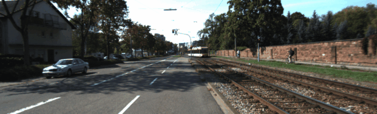
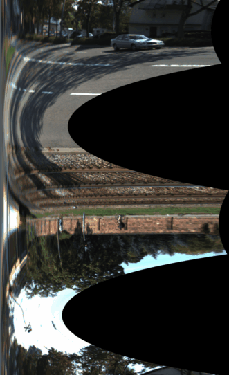
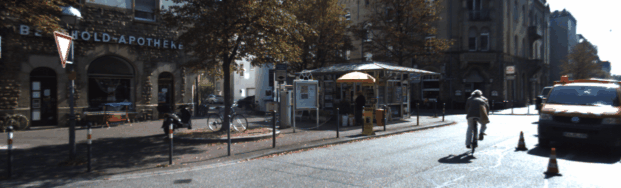
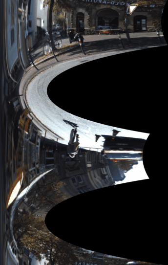

# PolarRectification

Stereo images polar rectification for general motion.

This is my initial implementation of "M. Pollefeys, R. Koch and L. Van Gool, A simple and efficient rectification method for general motion", 
[http://www.inf.ethz.ch/personal/pomarc/pubs/PollefeysICCV99.pdf](http://www.inf.ethz.ch/personal/pomarc/pubs/PollefeysICCV99.pdf).

 This code is heavily based on the code from Néstor Morales Hernández 'PolarCalibration' 
 [https://github.com/nestormh/PolarCalibration](https://github.com/nestormh/PolarCalibration)

Camara rotation is compensated using homography estimated based on cv::findEssentialMat() and cv::recoverPose().
This compensation is required to make the camera axes parallel (seeing in the same direction) when camera is rotating between frames.
After applying such 'derotation homography' the disparities become directed into single side (from left to right when moving forward).

TODO: Check if cv::warpPolar() could be usefull.

Example images:

--

