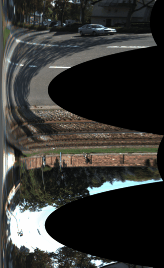

# PolarRectification

Stereo images polar rectification for general motion.

This is my initial implementation of "M. Pollefeys, R. Koch and L. Van Gool, A simple and efficient rectification method for general motion", 
[http://www.inf.ethz.ch/personal/pomarc/pubs/PollefeysICCV99.pdf](http://www.inf.ethz.ch/personal/pomarc/pubs/PollefeysICCV99.pdf).

 This code is heavily based on the Néstor Morales Hernández 'PolarCalibration' project 
 [https://github.com/nestormh/PolarCalibration](https://github.com/nestormh/PolarCalibration)

It seems the result is quite sensitive to image distortion, rolling shutter effects, as well as presense of moving objects on scene. 

Example image:

